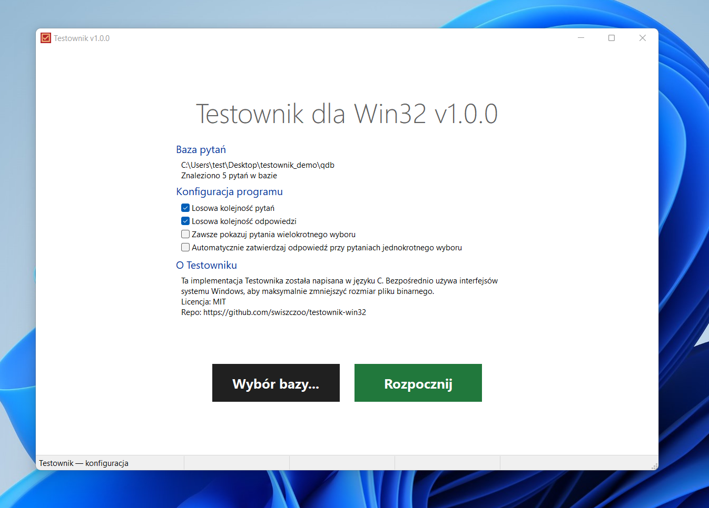
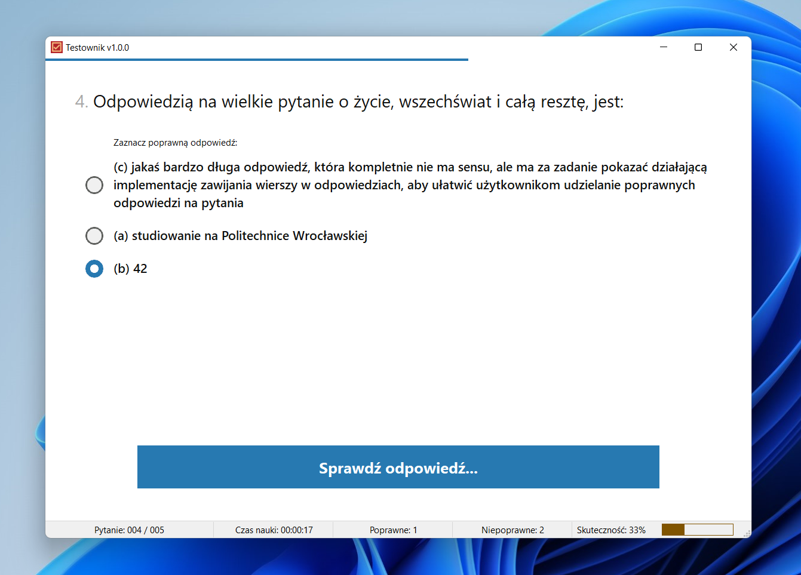
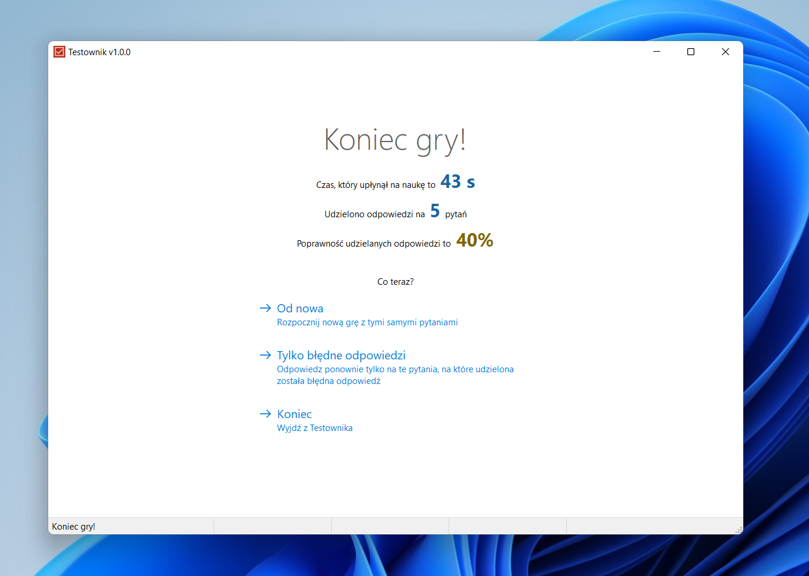
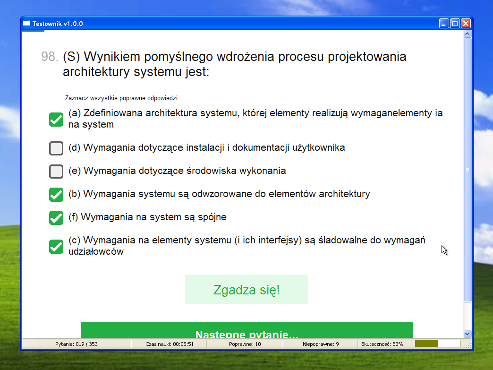
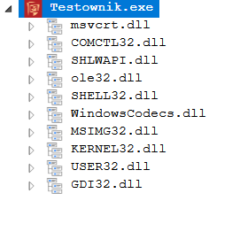

# Testownik-Win32

> This project is a pure C/Win32 implementation of a university-specific  quiz learning tool called 'Testownik'. The rest of this README is in Polish.

Kolejna implementacja PWr-owego Testownika. Celem projektu było stworzenie jak najmniejszej paczki dystrybucyjnej, którą można spakować razem z bazą pytań i rozesłać studentom. Dodatkowo, aplikacja powinna być nieco przyjemniejsza dla oka niż Swingowa atrapa skórki z MacOS X.

Aplikacja obsługuje jedynie nowy format pytań Testownika (pliki tekstowe zaczynające się od `QQ`).

## Zrzuty ekranu

## Gra z klawiatury

Tak jak poprzednie implementacje, Testownik-Win32 obsługuje grę z klawiatury:
+ klawisze `a-z` zaznaczają odpowiedź oznaczoną odpowiednim symbolem
+ klawisze `0-9` zaznaczają odpowiedź na pozycji odpowiadającej wciśniętemu klawiszowi (klawisz `0` zaznacza dziesiątą odpowiedź od góry listy)
+ klawisz `Spacja` potwierdza wybór lub przechodzi do następnego pytania

## Technologia

Testownik-Win32 jest napisany w C i używa bezpośrednio interfejsów API systemu Windows. Dzięki temu nie ma on żadnych dodatkowych zależności (powinien się uruchomić na każdym komputerze z Windowsem), kompiluje się do pojedynczego pliku `*.exe` i nie zajmuje 150MB dysku (patrzę na ciebie, Electron.js!). Pierwsza wersja programu ma rozmiar niecałych 50KB. Co ciekawe, po niewielkich modyfikacjach i wybraniu odpowiedniego toolsetu, Testownik-Win32 może w dużej części działać nawet na Windowsie XP:

## Budowanie projektu

Na chwilę obecną wspierany jest jedynie kompilator MSVC. Sam projekt wykorzystuje generator CMake i garść presetów w celu ułatwienia kompilacji. W celu jeszcze większego zmniejszenia rozmiaru pliku wykonywalnego, projekt obsługuje nieoficjalne linkowanie do wbudowanego w Windowsa runtime'u `MSVCRT.dll`. Generuje to niestety kilka problemów:
+ nie ma implementacji większości operacji na typach zmiennoprzecinkowych
+ brakuje implementacji 64-bitowej arytmetyki dla architektury x86
+ ramki stosu nie mogą być większe niż 4KB
  
Projekt ma skonfigurowaną ciągłą integrację (CI), więc można pobrać najnowsze pliki wykonywalne z podstrony Github Actions.

## Zależności

Testownik-Win32 jest zależny jedynie od komponentów systemu Windows. Oto drzewo zależności:

## Licencja

Testownik-Win32 jest dostępny na licencji MIT. (C) 2024 Łukasz Świszcz.

